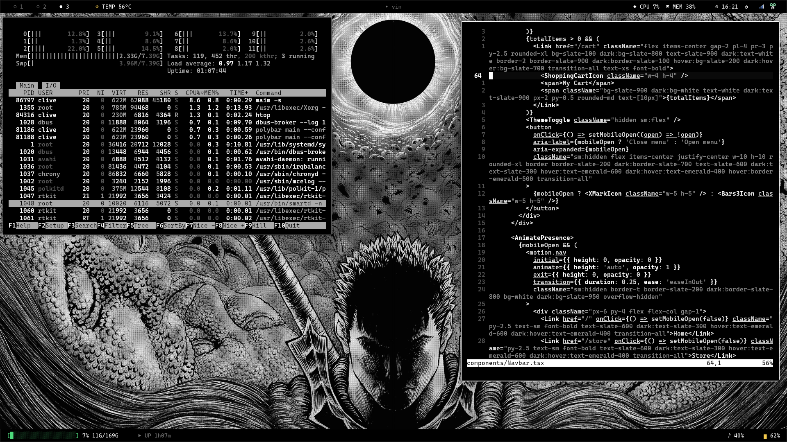
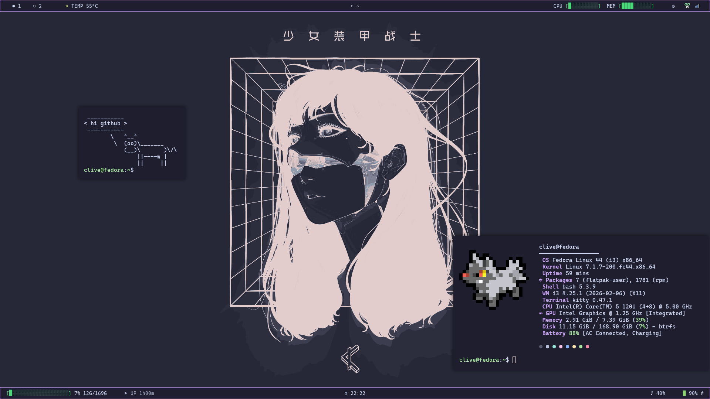

# dotfiles

My full i3 rice: window manager, bars, terminal, browser, editor, notifications,
launcher, compositor, lock screen, login screen, GTK/Qt app theming, and
wallpapers — three swappable themes (bw / invert / catppuccin) that toggle
together across all of it.




## Install (Fedora)

```
./install.sh
```

This installs every package the rice needs via `dnf`, then symlinks each
folder here into place under `~/.config` (and the wallpapers into
`~/Downloads`), backing up anything already there first.

On another distro: install the equivalent packages yourself (see
`install.sh` for the full list) and symlink the folders the same way.

After installing, log out and back into i3, or run
`~/.config/rice/toggle-theme.sh` twice to force every app to reload.

## What's in here

| Folder | What it is |
| --- | --- |
| `i3/` | Window manager config + per-theme border/title colors |
| `polybar/` | Top bar (workspaces, temp, date, cpu/mem bars via `cpu.sh`/`mem.sh`) and bottom bar (duf-style `/` usage, uptime, now-playing, volume, battery) |
| `kitty/` | Terminal config + per-theme colors |
| `dunst/` | Notification daemon config, per theme |
| `rofi/` | Launcher, calculator, emoji picker, clipboard picker (scripts + per-theme `.rasi`) |
| `qutebrowser/` | Browser config (theme-aware, reads `rice/theme`) |
| `picom/` | Compositor: fades, shadows, rounded corners, open/close animations |
| `gammastep/` | Fixed dawn/dusk color temperature window (no longer auto-started; see `gammastep-prompt` below) |
| `flameshot/` | Screenshot tool config |
| `fastfetch/` | Theme-matched, animated system-info banner on new terminals — always shows a random Pokemon (via `pokemon-colorscripts`, auto-cloned by `install.sh`) instead of a plain logo |
| `rice/` | The glue: `toggle-theme.sh` (cycles bw → invert → catppuccin across everything), `set-wallpaper.sh`, lock screen, on-screen volume/brightness display, workspace layout save/restore, scratchpad terminal, focus-border pulse, `gammastep-prompt.sh` (dusk notification asking whether to turn on warm colors, fired by the `gammastep-prompt` systemd --user timer below), Obsidian theme CSS |
| `systemd/user/` | `gammastep-prompt.timer` fires at 19:00 daily, running `gammastep-prompt.service` → `rice/gammastep-prompt.sh` |
| `wallpapers/` | Images `set-wallpaper.sh` picks from at random — `wallpaper/` for the catppuccin theme, `wallpaper-bw/` for bw/invert |
| `lightdm/` | Login screen greeter config — background is generated at install time from `wallpapers/wallpaper-bw` via the same grayscale/blur/dim treatment `rice/lock.sh` uses, so login and lock screen match. `install.sh` also switches the system's display manager to lightdm if it isn't already |
| `gtk-3.0/`, `gtk-4.0/` | GTK app theming: dark Adwaita, Adwaita icons/cursor, Cascadia Mono NF |
| `qt5ct/`, `qt6ct/` | Qt app theming: Fusion style, custom `bw` color scheme, same font. Only takes effect because of the `QT_QPA_PLATFORMTHEME` env var set in `x11/` below |
| `x11/` | `.xprofile` (sets `QT_QPA_PLATFORMTHEME=qt5ct`) and an `environment.d` drop-in that sets the same var a second way, for apps that read one but not the other |
| `vim/`, `nvim/` | Shared, rice-reactive colorscheme (reads `rice/theme`, same as everything else) — `nvim/init.vim` just sources `vim/vimrc` so vim and nvim look identical |
| `bash/bashrc.d/` | `aliases.sh` (`vim` → `nvim`) and `git-title.sh` (shows dir + git branch in the kitty tab title) |

## Not included / external

These are referenced by scripts here but aren't part of this repo — install
or configure them separately if you use them:

- **google-chrome-stable** — not in Fedora's repos; `rice/chrome-launch.sh`
  launches it with dark-mode flags matched to the active theme.
- **spicetify** — Spotify theming; `rice/toggle-theme.sh` calls
  `~/.spicetify/spicetify` if it exists, no-ops otherwise.
- **Obsidian** — `rice/obsidian/theme-*.css` gets copied into a vault's
  theme folder on toggle. `rice/toggle-theme.sh` hardcodes the vault path
  (`/home/clive/code/course/comp sci`) — edit that line to point at your own
  vault, or leave it; it's skipped if the folder doesn't exist.
- **copyq clipboard history** — the app is installed (used for the
  `$mod+Shift+v` picker), but its own state/history isn't shipped here.

## Keybindings

See `i3/config` for the full list. The highlights: `$mod+d` rofi launcher,
`$mod+Shift+t` cycle theme, `$mod+Shift+v` clipboard history,
`` $mod+` `` scratchpad terminal, `$mod+Shift+u` / `$mod+y` save/restore
layout, `$mod+Shift+y` toggle the bottom bar, `$mod+Shift+s` region
screenshot to clipboard, `Print` flameshot.
